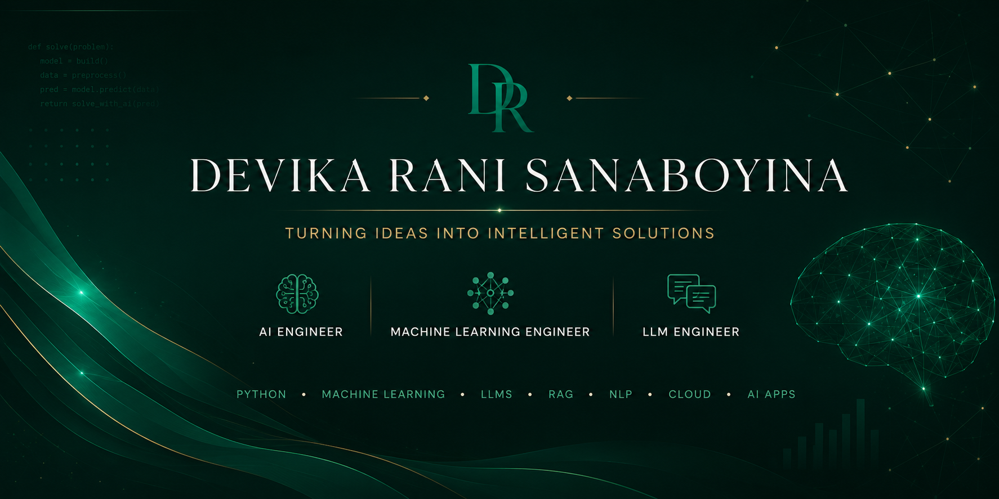

# About Me:
My interest in Data Science started with a simple curiosity: how can data help us understand people, patterns, and decisions better? Over time, that curiosity grew into a strong interest in AI, machine learning, analytics, and LLM-based applications.

I’m a Data Science graduate from UMBC with experience in data analysis, dashboard development, machine learning projects, and interactive map-based visualizations using Python, Tableau, Folium, and geospatial data. I also gained project management experience through the UMBC Odyssey Program. 

## 🌐 Socials:
 

# 💻 Tech Stack:
              
# 📊 GitHub Stats:
 
 

### ✍️ Random Dev Quote

---

<picture>
  <source media="(prefers-color-scheme: dark)" srcset="https://raw.githubusercontent.com/Devikz/Devikz/output/github-snake-dark.svg" />
  <source media="(prefers-color-scheme: light)" srcset="https://raw.githubusercontent.com/Devikz/Devikz/output/github-snake.svg" />
  
</picture>

<!-- Proudly created with GPRM ( https://gprm.itsvg.in ) -->
